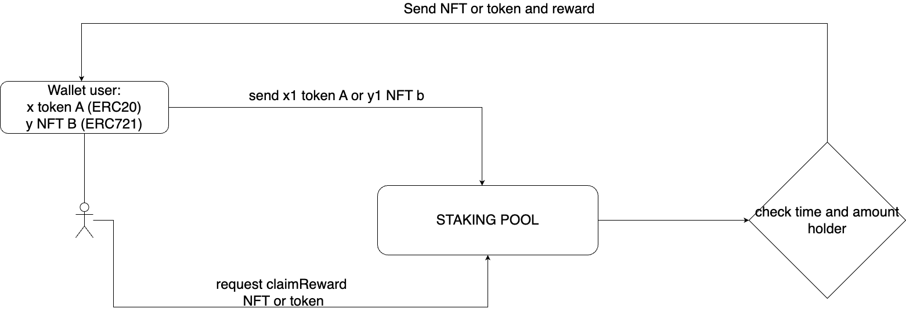

# Stacking_NFT_TOKEN


## Description
work flow uml: 


## Installation

```bash
npm install --save-dev

npx hardhat run scripts/deploy.js --network sepolia

npx hardhat test scripts/testTransactionToken.js --network sepolia

npx hardhat test scripts/testStakingNFTPool.js --network sepolia

npx hardhat test scripts/testStakingTokenPool.js --network sepolia
